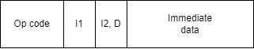

# blogvm - A simple VM project to go with a blog series
I'm currently writing a blog series to go with this project, the
first of which is available [here](https://www.stephengream.com/writing-a-vm-part-one)

## Instruction structure
This VM is a 32-bit computer, meaning the control unit executes instructions that are
32 bits in length. We will use hexadecimal here to simplify reading.

Instructions consist of four parts:
* **The Opcode** - One byte for the instruction to execute, for example an add or multiply operation
* **Input 1 (`I1`)** - 4 bits for the first input register, we will elaborate on how to address these later
* **Input 2/Destination (`I2`/`D`)** - 4 bits for the second input register, which will double as a destination value.
* **Immediate data** - 2 bytes for any immediate data. More on this later

## Instruction Reference
| Hex Value | Mnemonic | Description                                        |
|-----------|----------|----------------------------------------------------|
| 0x00      | HALT     | Halt the machine                                   |
| 0x01      | READ     | Read from the memory address in I1                 |
| 0x02      | WRITE    | Write to the memory address in D                   |
| 0x03      | COPY     | Copy from register I1 to D                         |
| 0x04      | ADD      | Add I1 to I2 and store in D                        |
| 0x05      | SUB      | Subtract I2 from I1 and store the result in D      |
| 0x06      | MUL      | Multiply I1 by I2 and store the result in D        |
| 0x07      | DIV      | Divide I1 by I2 and store the result in D          |
| 0x08      | STAT     | Get the status at bit I1 and store the result in D |
| 0x09      | SET      | Set the status at bit I1 to I2                     |
| 0x0A      | PUSH     | Push the value of I1 onto the stack                |
| 0x0B      | POP      | Pop a value off the stack and into I2              |
| 0x0C      | JMP      | Set PC to the address in I1                        |
| 0x0D      | LESS     | Run the next instruction only if I1 < I2           |
| 0x0E      | LTE      | Run the next instruction only if I1 <= I2          |
| 0x0F      | GT       | Run the next instruction only if I1 > I2           |
| 0x10      | GTE      | Run the next instruction only if I1 >= I2          |
| 0x11      | EQ       | Run the next instruction only if I1 = I2           |
| 0x12      | CALL     | Set the PC to the address in I1                    |
| 0x13      | RETURN   | Return to the last `CALL` location                 |

## Assembler Directives
| Directive | Description                               |
|-----------|-------------------------------------------|
| WORD      | Sets a memory location to a certain value |
| STRING    | Inserts a into a chunk of memory          |
| ADDRESS   | Sets I2 to an address of a label          |

## Addressing registers
Each register is addressed with 4 bits of data, potentially refering to 16 different
registers. The value 0xF refers to the **immediate data** in an instruction

| Hex Value | Mnemonic | Description          | Initial Value |
|-----------|----------|----------------------|---------------|
| 0x0       | R0       | First ALU register   | 0x00          |
| 0x1       | R1       | Second ALU register  | 0x00          |
| 0x2       | R2       | Third ALU register   | 0x00          |
| 0x3       | R3       | Fourth ALU register  | 0x00          |
| 0xB       | SP       | Stack pointer        | 0xFFE0        |
| 0xC       | SR       | Status register      | 0x00          |
| 0xD       | PC       | Program counter      | 0x100         |
| 0xE       | IR       | Instruction register | 0x00          |
| 0xF       | #{n}     | Immediate data       | N/A           |

## Status Flags
The bits in the `SR` each represent a flag to convey status in the machine, with bit 0 being the least significant
bit.

| Bit number | Mnemonic              | Description                                                     |
|------------|-----------------------|-----------------------------------------------------------------|
| 0          | STATUS_HALT           | Whether the machine has been halted                             |
| 1          | STATUS_OVERFLOW       | If an integer overflow has occurred                             |
| 2          | STATUS_UNDERFLOW      | If an integer underflow has occurred                            |
| 3          | STATUS_DIVIDE_BY_ZERO | If the machine has attempted to divide a number by zero         |
| 4          | STATUS_MEMORY_ERROR   | If the machine has experienced an error trying to access memory |

## Todos
* Interrupts
* Bitwise operations
* UI
* Console
* Small screen